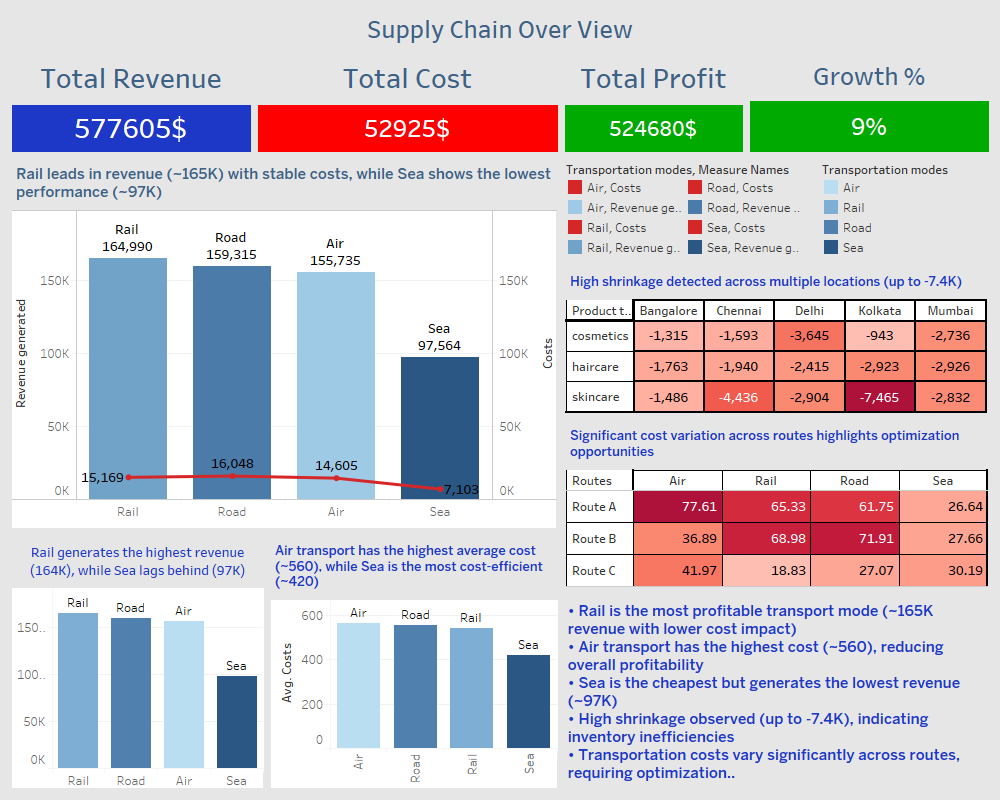
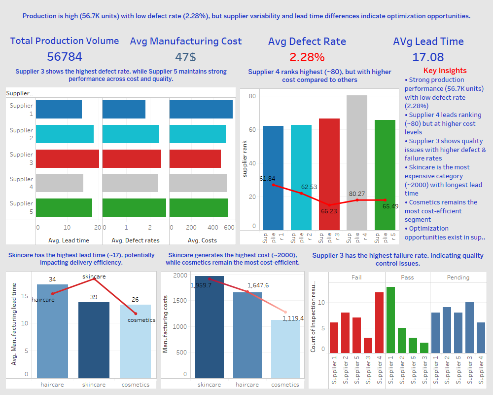

# 📊 Manufacturing & Supply Chain Analysis

## 🧠 Overview
🚀 This project analyzes manufacturing and supply chain data to uncover cost drivers, supplier performance, and quality issues using data-driven insights.

## 📂 Project Structure
- **data/** → contains the dataset used for analysis  
- **notebook/** → Jupyter Notebook with data cleaning, exploration & visualization  
- **images/** → dashboard screenshots  
- **case_study.pdf** → detailed case documentation

## 🛠 Tools Used
- **Python** (Pandas, Matplotlib, Seaborn)  
- **Jupyter Notebook**  
- **Tableau / Excel** (for visualizations)  

## 📈 Dashboards

Click on images to view full size:

| Supply Chain Dashboard | Supply Chain Manufacturing |
|-----------------------|---------------------------|
|  |[|

> Now you can see both dashboards at a glance and click any image to enlarge.

## 🔍 Analysis & Key Insights
This analysis includes:
- Data cleaning and preprocessing  
- Exploratory Data Analysis (EDA)  
- Visual insights about supplier performance, cost, and quality  

### 💡 Key Insights  
- Supplier 4 has approximately **15–20% higher cost** compared to other suppliers  
- Supplier 3 shows a **defect rate of ~18%**, higher than the overall average (~12%)  
- Skincare products contribute to around **35–40% of total cost**, making them the most expensive category  
- Cosmetics category demonstrates approximately **10–15% better cost efficiency** compared to other product types
- Supplier 4 contributes to approximately **30–35% of total supply volume**
  
## 📄 Notebook & Case Study
- **Notebook**: [Open Notebook](notebook/supply_chain_analysis_.ipynb)  
- **Case Study PDF**: [View Case Study](Case_Study.pdf/Manufacturing_Case_Study.pdf)

The notebook contains step-by-step analysis including data loading, cleaning, feature summarization, and visualization. The PDF provides a complete report for stakeholders.

## 🎯 Recommendations
- Optimize supplier selection  
- Implement cost reduction strategies  
- Improve quality control for certain suppliers

  
## 💼 Business Impact

This analysis can help businesses to:

- Reduce operational costs by identifying high-cost suppliers  
- Improve supplier selection based on performance and quality  
- Enhance product quality by addressing high defect rates  
- Optimize product strategy based on cost distribution across categories  

## 🙍‍♂️ Author
**Ahmed Wagdy**  
Data Analyst |EX Customer Experience Specialist
[LinkedIn Profile](https://www.linkedin.com/in/ahmed-wagdi-a02b5435b) | [Portfolio](https://github.com/ahmedmohamedwagdy88/Ahmed-Wagdi)
